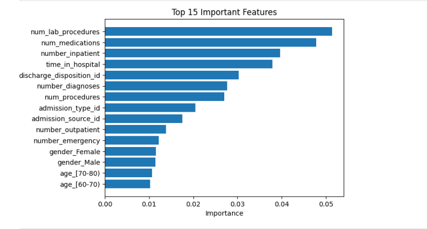
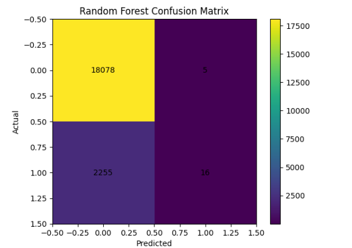
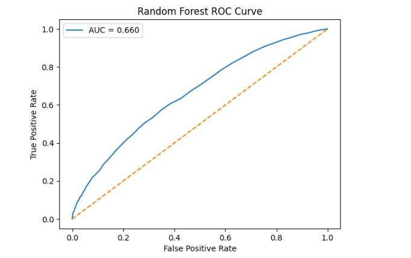
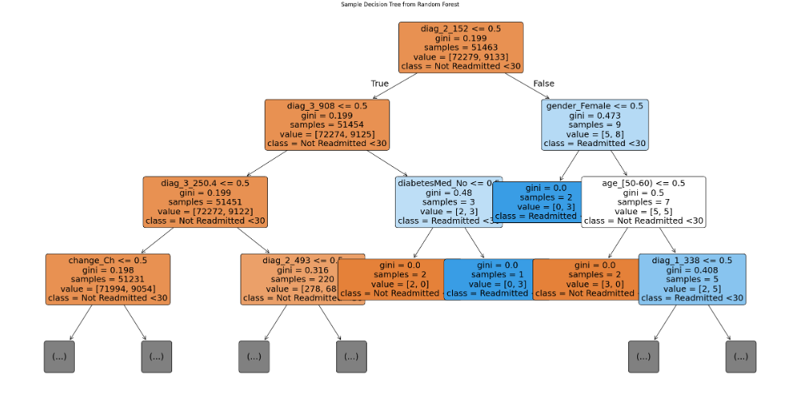

# Predicting 30-Day Hospital Readmission Risk Among Diabetic Patients Using Machine Learning

**Machine Learning | Healthcare Analytics | Predictive Modeling | Python | Scikit-Learn**



## Project Highlights

✔️ Analyzed 101,766 hospital encounters

✔️ Built 3 machine learning models

✔️ Compared Logistic Regression, Random Forest, and Gradient Boosting

✔️ Evaluated using Accuracy, Precision, Recall, F1-score, and ROC-AUC

✔️ Identified key predictors of diabetic patient readmission

## Objective

Develop and compare machine learning models to predict 30-day hospital readmission among diabetic patients using demographic, clinical, and hospitalization-related variables.

## Dataset
- 101,766 patient encounters
- 50 variables
- Target:
  - 1 → Readmitted within 30 days
  - 0 → Not Readmitted

## Models Used
- Logistic Regression
- Random Forest
- Gradient Boosting

## Evaluation Metrics
- Accuracy
- Precision
- Recall
- F1 Score
- ROC–AUC

## Skills Demonstrated

- Data Cleaning
- Exploratory Data Analysis (EDA)
- Feature Engineering
- Machine Learning
- Model Evaluation
- Healthcare Analytics
- Predictive Modeling
- Data Visualization

## Tech Stack

- Python
- Pandas
- NumPy
- Scikit-learn
- Matplotlib

## Why This Project Matters

Hospital readmissions increase healthcare costs and may indicate gaps in patient care. Predicting patients at higher risk of readmission can support early interventions, improve care coordination, and reduce avoidable hospitalizations.


## Key Findings

- Logistic Regression achieved **64.4% accuracy** while identifying more readmission cases.
- Random Forest achieved the highest overall accuracy (**88.9%**).
- ROC-AUC score of **0.660** indicates moderate predictive performance.
- Hospital utilization variables (lab procedures, medications, inpatient visits, and length of stay) were among the most influential predictors.

## Project Visualizations

### Random Forest Confusion Matrix
The confusion matrix summarizes the model's prediction performance by comparing actual and predicted readmission outcomes.



---

### ROC Curve
The ROC curve evaluates the model's ability to distinguish between readmitted and non-readmitted patients. The model achieved an ROC-AUC score of **0.660**, indicating moderate predictive performance.



---

### Sample Decision Tree
A representative decision tree from the Random Forest model illustrating how diagnosis, medication, and demographic features contribute to prediction decisions.




## Clinical Impact
Predictive analytics can support early identification of high-risk diabetic patients and improve care coordination.

## Future Improvements

- Address class imbalance using advanced resampling techniques.
- Compare additional machine learning models such as XGBoost.
- Optimize model hyperparameters.
- Develop an interactive dashboard for visualization.

## Conclusion

This project demonstrates the application of machine learning in healthcare analytics to predict 30-day hospital readmission among diabetic patients. By comparing multiple classification models and evaluating both predictive performance and clinical relevance, the analysis highlights the potential of data-driven approaches to support early risk identification and improve patient care.

## Repository Structure

```text
README.md
Diabetic_Readmission_Prediction.ipynb
diabetic_data.csv
feature_importance.png
confusion_matrix.png
roc_curve.png
decision_tree.png
```
## Author

**Mohd Adnaan Khan**

M.S. Health Data Science | Saint Louis University

LinkedIn: https://www.linkedin.com/in/mohd-adnaan-khan-147b681a9/

GitHub: https://github.com/Adnaan-khan
